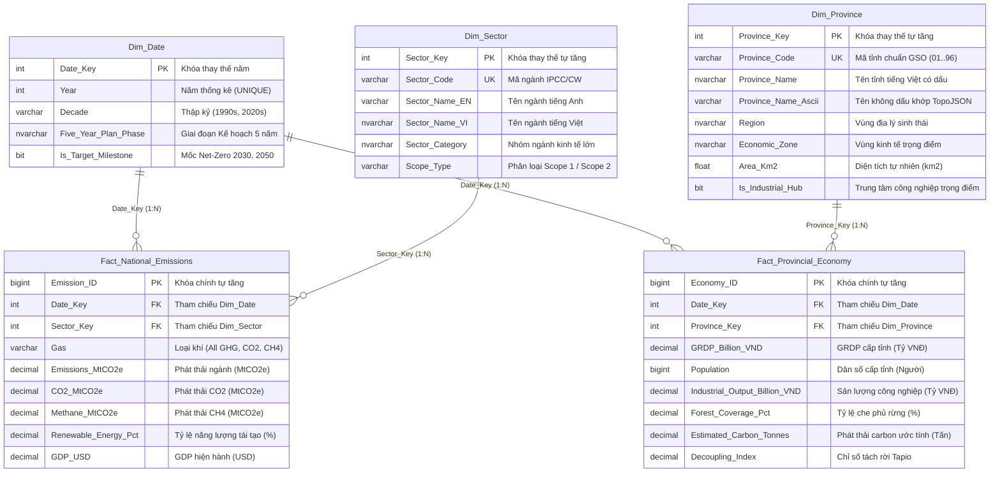

# Thiết Kế Kiến Trúc Kho Dữ Liệu Đa Chiều (Star Schema Design)
## Vietnam Greenhouse Gas Emission Monitoring Data Warehouse Towards Net-Zero

- **Tên dự án:** Xây dựng Kho Dữ Liệu Giám Sát Phát Thải Khí Nhà Kính Hướng Tới Net-Zero Tại Việt Nam
- **Tác giả:** Đội ngũ Kỹ sư DWH (BMAD Multi-Agent Team)
- **Phương pháp luận:** Chuẩn thiết kế mô hình đa chiều Kimball (Kimball Dimensional Modeling)
- **Phiên bản:** 1.0.0
- **Ngày hoàn thiện:** 2026-09-25
- **Trạng thái:** Approved (Tuần 2 - Phase 1 Deliverable)

---

## 1. Tổng Quan & Nguyên Lý Thiết Kế Kimball

Kho dữ liệu (Data Warehouse - DWH) phục vụ việc theo dõi tiến trình Net-Zero của Việt Nam được thiết kế theo trường phái **Mô hình đa chiều Kimball (Dimensional Modeling)** với cấu trúc **Lược đồ hình sao (Star Schema)**.

### Quy trình 4 bước thiết kế đa chiều (The 4-Step Dimensional Design Process):
1. **Chọn quy trình nghiệp vụ (Select the Business Process):**
   - Giám sát phát thải khí nhà kính toàn quốc phân bổ theo ngành kinh tế (National GHG & Energy Ingestion).
   - Giám sát tương quan giữa tăng trưởng kinh tế (GRDP, Sản lượng công nghiệp) và phát thải carbon cấp tỉnh (Provincial Socio-Economic & Decoupling Monitoring).
2. **Khai báo mức độ chi tiết (Declare the Grain):**
   - *Quy trình Quốc gia:* 1 bản ghi = Lượng phát thải của 1 phân ngành/loại khí trong 1 năm tại Việt Nam.
   - *Quy trình Cấp tỉnh:* 1 bản ghi = Các chỉ số kinh tế và phát thải ước tính của 1 tỉnh thành trong 1 năm.
3. **Xác định các chiều phân tích (Identify the Dimensions):**
   - Chiều thời gian (`Dim_Date`), Chiều địa lý hành chính (`Dim_Province`), Chiều lĩnh vực/ngành phát thải (`Dim_Sector`).
4. **Xác định các chỉ số đo lường (Identify the Numeric Facts):**
   - Phát thải GHG, CO2, Methane, Tỷ lệ năng lượng tái tạo, GDP, GRDP, Dân số, Sản lượng công nghiệp, Độ che phủ rừng, Lượng carbon ước tính, Chỉ số Decoupling.

---

## 2. Ma Trận Nghiệp Vụ Doanh Nghiệp (Enterprise Bus Matrix)

Ma trận Bus Matrix thể hiện mối quan hệ giữa các quy trình nghiệp vụ (tương ứng với các bảng Fact) và các chiều phân tích dùng chung (**Conformed Dimensions**).

| Quy trình Nghiệp Vụ (Fact Tables) | `Dim_Date` (Thời Gian) | `Dim_Province` (Tỉnh Thành) | `Dim_Sector` (Ngành Phát Thải) |
|---|:---:|:---:|:---:|
| **1. National GHG Emissions** (`Fact_National_Emissions`) | **X** (Conformed) | | **X** |
| **2. Provincial Economy & Emissions** (`Fact_Provincial_Economy`) | **X** (Conformed) | **X** | |

> [!IMPORTANT]
> **Vai trò của Conformed Dimension `Dim_Date`:**  
> Bảng `Dim_Date` đóng vai trò là "chiều cầu nối chuẩn tắc" giữa cấp quốc gia và cấp địa phương. Người dùng trên Power BI có thể lọc theo 1 năm hoặc 1 giai đoạn kế hoạch 5 năm cụ thể, hệ thống sẽ đồng thời hiển thị tổng phát thải toàn quốc theo ngành song song với bản đồ phân bổ phát thải và tăng trưởng kinh tế của 63 tỉnh thành mà không làm sai lệch Grain.

---

## 3. Khai Báo Chi Tiết Mức Độ Hạt (Grain Declaration)

### 3.1. Fact_National_Emissions
- **Business Process:** Theo dõi phát thải khí nhà kính và chuyển dịch năng lượng quốc gia từ World Bank và ClimateWatch.
- **Grain:** Mức độ chi tiết nguyên tử (Atomic Grain) là **1 dòng cho 1 lĩnh vực (`Sector_Code`), 1 loại khí (`Gas`) trong 1 năm (`Year`) tại Việt Nam**.
- **Tính chất đo lường (Fact Types):**
  - `Total_GHG_MtCO2e`, `CO2_MtCO2e`, `Methane_MtCO2e`: Chỉ số đo lường cộng gộp đầy đủ (**Fully Additive** across Date and Sector).
  - `Renewable_Energy_Pct`: Chỉ số không cộng gộp trực tiếp (**Non-Additive**), cần tính bình quân gia quyền.
  - `GDP_USD`: Bán cộng gộp (**Semi-Additive** across Date).

### 3.2. Fact_Provincial_Economy
- **Business Process:** Theo dõi phát triển kinh tế xã hội và chỉ số tách rời tăng trưởng với phát thải (Decoupling Index) 63 tỉnh thành từ Niên giám Thống kê GSO.
- **Grain:** Mức độ chi tiết nguyên tử là **1 dòng cho 1 tỉnh thành (`Province_Code`) trong 1 năm (`Year`)**.
- **Tính chất đo lường (Fact Types):**
  - `GRDP_Billion_VND`, `Industrial_Output_Billion_VND`, `Estimated_Carbon_Tonnes`: Cộng gộp đầy đủ (**Fully Additive** across Date and Province).
  - `Population`: Bán cộng gộp (**Semi-Additive** across Date, Additive across Provinces).
  - `Forest_Coverage_Pct`, `Decoupling_Index`: Không cộng gộp (**Non-Additive**).

---

## 4. Thiết Kế Cấu Trúc Phân Cấp Chiều Phân Tích (Dimension Hierarchies)

Nhằm tối ưu hóa trải nghiệm Drill-down / Roll-up trên Dashboard Power BI (Tuần 4), các bảng Dimension được chuẩn hóa với các cấu trúc phân cấp đa tầng:

### 4.1. Phân cấp Thời gian (`Dim_Date`) - Phân cấp trực giao (Dual Orthogonal Paths)
Do các chu kỳ Kế hoạch 5 năm của Việt Nam có thể vắt ngang giữa các thập kỷ, mô hình thiết lập 2 nhánh phân cấp độc lập phục vụ linh hoạt góc nhìn phân tích:
* **Nhánh Thập kỷ:** `Decade` $\rightarrow$ `Year` (VD: `2020s` $\rightarrow$ `2023`)
* **Nhánh Kế hoạch 5 năm:** `Five_Year_Plan_Phase` $\rightarrow$ `Year` (VD: `Kế hoạch 2021-2025` $\rightarrow$ `2023`)
* **Cờ mốc chiến lược:** `Is_Target_Milestone` đánh dấu năm 2030 (NDC) và năm 2050 (Net-Zero).

### 4.2. Phân cấp Địa lý (`Dim_Province`) - Phân cấp song song (Dual Regional Paths)
Do một số tỉnh thuộc vùng kinh tế trọng điểm nằm giao thoa hoặc một số tỉnh miền núi không thuộc Vùng KTTĐ nào (`Economic_Zone = 'Khác'`), mô hình chia làm 2 đường phân cấp song song trên Power BI:
* **Nhánh Địa lý Sinh thái:** `Region` $\rightarrow$ `Province_Name` (VD: `Đồng bằng sông Hồng` $\rightarrow$ `Hà Nội`)
* **Nhánh Vùng Kinh tế Trọng điểm:** `Economic_Zone` $\rightarrow$ `Province_Name` (VD: `KTTĐ Bắc Bộ` $\rightarrow$ `Hà Nội`)
* **Cờ công nghiệp:** `Is_Industrial_Hub` phân loại các cực công nghiệp phát thải lớn.

### 4.3. Phân cấp Ngành Phát Thải (`Dim_Sector`)
```
[Phạm vi - Scope_Type] ──► [Nhóm ngành - Sector_Category] ──► [Lĩnh vực - Sector_Name_VI]
(VD: Scope 1)              (VD: Energy)                       (VD: Sản xuất Điện & Nhiệt)
```

---

## 5. Từ Điển Dữ Liệu Chi Tiết (Data Dictionary)

> [!TIP]
> **Chuẩn hóa Kiểu Dữ Liệu Chính Xác (Exact Numeric Precision):**  
> Nhằm triệt tiêu hiện tượng sai số dấu phẩy động (IEEE 754 floating-point artifacts) trên SQL Server và Power BI, toàn bộ các trường tiền tệ, sản lượng và chỉ số đo lường được chuẩn hóa sang kiểu `DECIMAL` thay vì `FLOAT`:
> - Giá trị kinh tế và tiền tệ (`GRDP`, `GDP`, `Sản lượng công nghiệp`): `DECIMAL(18, 2)`
> - Khối lượng phát thải và chỉ số hiệu suất (`Emissions_MtCO2e`, `Decoupling_Index`): `DECIMAL(18, 4)`
> - Tỷ lệ phần trăm (`Forest_Coverage_Pct`, `Renewable_Energy_Pct`): `DECIMAL(5, 2)`

### 5.1. Bảng Chiều (Dimension Tables)

#### Bảng `Dim_Date`
| Tên Cột | Kiểu Dữ Liệu | Ràng Buộc | Mô Tả Nghiệp Vụ | Dữ Liệu Mẫu |
|---|---|:---:|---|---|
| `Date_Key` | `INT` | **PK** | Khóa thay thế định danh năm (YYYY) | `2023` |
| `Year` | `INT` | NOT NULL, UNIQUE | Năm thống kê | `2023` |
| `Decade` | `VARCHAR(20)` | NOT NULL | Thập kỷ tương ứng | `'2020s'` |
| `Five_Year_Plan_Phase` | `NVARCHAR(50)` | NOT NULL | Giai đoạn Kế hoạch phát triển KT-XH 5 năm | `N'Kế hoạch 2021-2025'` |
| `Is_Target_Milestone` | `BIT` | NOT NULL | Đánh dấu mốc cam kết Net-Zero chiến lược | `0` (hoặc `1` cho 2030, 2050) |

#### Bảng `Dim_Province`
| Tên Cột | Kiểu Dữ Liệu | Ràng Buộc | Mô Tả Nghiệp Vụ | Dữ Liệu Mẫu |
|---|---|:---:|---|---|
| `Province_Key` | `INT` | **PK (IDENTITY)** | Khóa thay thế tự tăng | `1` |
| `Province_Code` | `VARCHAR(10)` | NOT NULL, UNIQUE | Mã hành chính chuẩn GSO (2 chữ số) | `'01'` |
| `Province_Name` | `NVARCHAR(100)` | NOT NULL | Tên tỉnh/thành phố có dấu | `N'Hà Nội'` |
| `Province_Name_Ascii` | `VARCHAR(100)` | NOT NULL | Tên không dấu khớp TopoJSON map | `'Ha Noi'` |
| `Region` | `NVARCHAR(50)` | NOT NULL | Vùng địa lý sinh thái | `N'Đồng bằng sông Hồng'` |
| `Economic_Zone` | `NVARCHAR(100)` | NOT NULL | Vùng kinh tế trọng điểm | `N'KTTĐ Bắc Bộ'` |
| `Area_Km2` | `DECIMAL(10, 2)` | NOT NULL | Diện tích tự nhiên (km2) | `3359.80` |
| `Is_Industrial_Hub` | `BIT` | NOT NULL | Cờ xác định trung tâm công nghiệp lớn | `1` |

#### Bảng `Dim_Sector`
| Tên Cột | Kiểu Dữ Liệu | Ràng Buộc | Mô Tả Nghiệp Vụ | Dữ Liệu Mẫu |
|---|---|:---:|---|---|
| `Sector_Key` | `INT` | **PK (IDENTITY)** | Khóa thay thế tự tăng | `1` |
| `Sector_Code` | `VARCHAR(20)` | NOT NULL, UNIQUE | Mã ngành quốc tế ClimateWatch / IPCC | `'ELE'` |
| `Sector_Name_EN` | `VARCHAR(100)` | NOT NULL | Tên tiếng Anh lĩnh vực phát thải | `'Electricity/Heat'` |
| `Sector_Name_VI` | `NVARCHAR(150)` | NOT NULL | Tên tiếng Việt lĩnh vực phát thải | `N'Sản xuất Điện & Nhiệt'` |
| `Sector_Category` | `NVARCHAR(50)` | NOT NULL | Nhóm phân loại ngành lớn | `N'Energy'` |
| `Scope_Type` | `VARCHAR(20)` | NULL | Phân loại phát thải Scope 1/2 | `'Scope 1'` |

---

### 5.2. Bảng Sự Kiện (Fact Tables)

#### Bảng `Fact_National_Emissions`
| Tên Cột | Kiểu Dữ Liệu | Ràng Buộc | Mô Tả Nghiệp Vụ | Đơn Vị Đo |
|---|---|:---:|---|---|
| `Emission_ID` | `BIGINT` | **PK (IDENTITY)** | Khóa chính tự tăng | ID số nguyên lớn |
| `Date_Key` | `INT` | **FK** $\rightarrow$ `Dim_Date` | Khóa ngoại liên kết thời gian | Năm YYYY |
| `Sector_Key` | `INT` | **FK** $\rightarrow$ `Dim_Sector` | Khóa ngoại liên kết lĩnh vực phát thải | ID ngành |
| `Gas` | `VARCHAR(20)` | NOT NULL | Loại khí phát thải (`All GHG`, `CO2`, `CH4`) | Chuỗi phân loại |
| `Emissions_MtCO2e` | `DECIMAL(18, 4)` | NOT NULL, $\ge 0$ | Tổng lượng phát thải phân bổ theo ngành | Triệu tấn CO2e (MtCO2e) |
| `CO2_MtCO2e` | `DECIMAL(18, 4)` | NULL, $\ge 0$ | Lượng phát thải CO2 riêng biệt | Triệu tấn CO2 (MtCO2) |
| `Methane_MtCO2e` | `DECIMAL(18, 4)` | NULL, $\ge 0$ | Lượng phát thải khí Methane | Triệu tấn CO2e (MtCO2e) |
| `Renewable_Energy_Pct` | `DECIMAL(5, 2)` | NULL, $0 \dots 100$ | Tỷ lệ năng lượng tái tạo toàn quốc | Phần trăm (%) |
| `GDP_USD` | `DECIMAL(18, 2)` | NULL, $\ge 0$ | Tổng sản phẩm quốc nội hiện hành | Đô la Mỹ (USD) |

> [!WARNING]
> **Biện pháp chống nhân đôi số liệu (Overcounting Safeguard) đối với `GDP_USD`:**  
> Do Grain của bảng là `Year x Sector x Gas`, trường vĩ mô `GDP_USD` và `Renewable_Energy_Pct` chỉ được gán giá trị tại dòng tổng hợp cấp quốc gia (`Sector_Code = 'TOT'`), các phân ngành cụ thể để `NULL`. Trên Power BI, DAX measure được định nghĩa chuẩn:  
> `National_GDP = CALCULATE(MAX(Fact_National_Emissions[GDP_USD]), ALL(Dim_Sector))` hoặc `AVERAGE(Fact_National_Emissions[GDP_USD])`.

#### Bảng `Fact_Provincial_Economy`
| Tên Cột | Kiểu Dữ Liệu | Ràng Buộc | Mô Tả Nghiệp Vụ | Đơn Vị Đo |
|---|---|:---:|---|---|
| `Economy_ID` | `BIGINT` | **PK (IDENTITY)** | Khóa chính tự tăng | ID số nguyên lớn |
| `Date_Key` | `INT` | **FK** $\rightarrow$ `Dim_Date` | Khóa ngoại liên kết thời gian | Năm YYYY |
| `Province_Key` | `INT` | **FK** $\rightarrow$ `Dim_Province` | Khóa ngoại liên kết tỉnh thành | ID tỉnh thành |
| `GRDP_Billion_VND` | `DECIMAL(18, 2)` | NOT NULL, $> 0$ | Tổng sản phẩm trên địa bàn tỉnh | Tỷ VNĐ |
| `Population` | `BIGINT` | NOT NULL, $> 0$ | Dân số trung bình cấp tỉnh | Người |
| `Industrial_Output_Billion_VND` | `DECIMAL(18, 2)` | NOT NULL, $\ge 0$ | Giá trị sản xuất công nghiệp tỉnh | Tỷ VNĐ |
| `Forest_Coverage_Pct` | `DECIMAL(5, 2)` | NOT NULL, $0 \dots 100$ | Tỷ lệ che phủ rừng (hấp thụ carbon) | Phần trăm (%) |
| `Estimated_Carbon_Tonnes` | `DECIMAL(18, 4)` | NOT NULL, $> 0$ | Lượng phát thải carbon ước lượng của tỉnh | Tấn CO2e |
| `Decoupling_Index` | `DECIMAL(18, 4)` | NOT NULL, $> 0$ | Chỉ số tách rời kinh tế - carbon | Điểm chỉ số Tapio |

---

## 6. Sơ Đồ Thực Thể Quan Hệ (Entity-Relationship Star Schema Diagram)



---

## 7. Chiến Lược Chỉ Mục & Tối Ưu Hóa Hiệu Năng (Indexing Strategy)

Để đảm bảo hiệu năng tối đa khi thực thi các phép nối đa chiều (Star Join OLAP) và lọc dữ liệu trên Power BI:

1. **Clustered Index (Mặc định trên Khóa chính):**
   - Đặt trên Primary Key của tất cả 5 bảng (`Date_Key`, `Province_Key`, `Sector_Key`, `Emission_ID`, `Economy_ID`) giúp việc sắp xếp vật lý dữ liệu tối ưu nhất.
2. **Non-Clustered Indexes trên các Khóa ngoại (FK Indexes):**
   - `IX_Fact_National_Date` trên `Fact_National_Emissions(Date_Key)`
   - `IX_Fact_National_Sector` trên `Fact_National_Emissions(Sector_Key)`
   - `IX_Fact_Provincial_Date` trên `Fact_Provincial_Economy(Date_Key)`
   - `IX_Fact_Provincial_Province` trên `Fact_Provincial_Economy(Province_Key)`
3. **Composite Non-Clustered Indexes (Chỉ mục kết hợp phân tích cao cấp):**
   - `IX_Fact_Provincial_Date_Province` trên `Fact_Provincial_Economy(Date_Key, Province_Key)` kèm các trường đo lường (`INCLUDE (GRDP_Billion_VND, Estimated_Carbon_Tonnes, Decoupling_Index)`). Giúp các truy vấn theo năm và tỉnh thành đạt trạng thái **Index Seek** hoàn toàn không cần đọc bảng gốc (Covering Index).

---

## 8. Kết Luận & Cổng Chuyển Giao (Phase Gate Approval)

Tài liệu thiết kế kiến trúc Star Schema đã hoàn thành đầy đủ các tiêu chuẩn kỹ thuật nghiêm ngặt nhất của mô hình dữ liệu đa chiều Kimball:
- [x] Có Enterprise Bus Matrix phân định rõ vai trò của Conformed Dimensions.
- [x] Khai báo Grain tường minh cho từng sự kiện.
- [x] Tách bạch phân cấp địa lý và thời gian phục vụ trực quan hóa TopoJSON và Kế hoạch 5 năm trên Power BI.
- [x] Đầy đủ từ điển dữ liệu, ràng buộc miền giá trị và sơ đồ thực thể Mermaid ERD.

**Quyết định phê duyệt:** Đủ điều kiện chuyển giao thực thi mã DDL tại **Phase 2 (Khởi tạo Database & Staging)** và **Phase 3 (Mã DDL Star Schema trên SQL Server)**.
